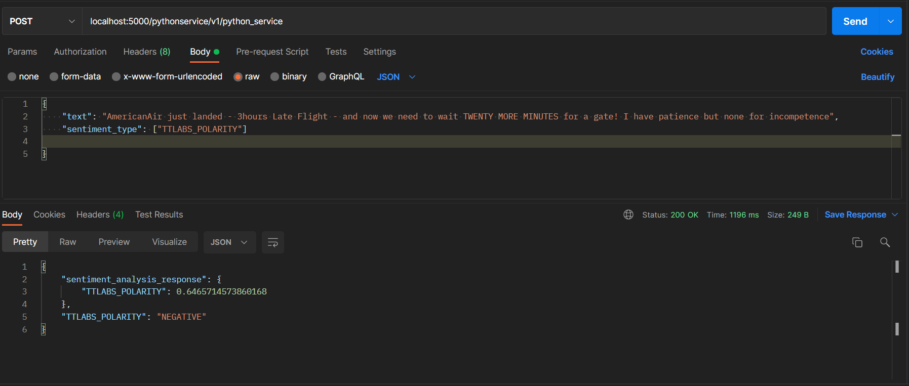

# Sentiment Analysis 

This project is a Sentiment Analysis project which is built in python and flask framework. Tensorflow and Keras were used to build the predictive model. The predictive model predicts whether a given text is positive, negative, or neutral. Kedro framework was used to build reproducible and concise code for the machine learning workflow. Flask was used to build the microservice to receive the request object from the frontend client.
 
## API Reference

#### Post a text and a list sentiment type

```http
  Post localhost:5000/pythonservice/v1/python_service
```

| Parameter | Type     | Description                       |
| :-------- | :------- | :-------------------------------- |
| `text`      | `string` | **Required**. Required, should not be null |
| `sentiment_type` | `string` |  **Required**. ["TEXTBLOB_POLARITY","TEXTBLOB_SUBJECTIVITY","TTLABS_POLARITY"]|


## Contributing

Contributions are always welcome!


See `contributing.md` for ways to get started.

Please adhere to this project's `code of conduct`.


## Deployment

To deploy this project use the github actions

```bash
   run deploy
```

## Documentation

[Documentation](https://linktodocumentation)


## Installation

Install VC_redist.x64.exe on your local device

```bash
   download and install from microsoft
```
    
## Run Locally

Clone the project

```bash
  git clone https://github.com/turntabl-sentiment-analysis/ml-pipeline.git
```

Go to the project directory

```bash
  cd ml-pipeline
```

Install dependencies

```bash
  pip install -r requirements.txt
```

Go to the project directory
```bash
  cd kedro_project 
```
```bash
  cd src
```

## Environment Variables

To run this project, you will need to chnage the following file path

`Sentiment.csv`

`sentiment.h5`

Start the server

```bash
  python main.py
```


## Roadmap

- Additional browser support

- Add more integrations


## Screenshots




## Badges

[](https://github.com/tterb/atomic-design-ui/blob/master/LICENSEs)

## Appendix

Thank you for using this project.
Contributors are Clavin, Simona, Edward, Phinehas, Selasi, Charlotte and Andrews from Turntabl Ghana.

## Running Tests

To run tests, run the following command

```bash
  pytest
```

## Authors

- [edward](https://github.com/edwardtsatsu)
- [selasi](https://github.com/selasi)
- [phinehas](https://github.com/phinehas)
- [charlotte](https://github.com/charlotte)
- [andrews](https://github.com/andrews)
- [simona](https://github.com/simona)
- [clavin](https://github.com/clavin)

## 🚀 About Us
We are a team of four who contributed to the development of this project. We work as software 
emgineers at turntabl Ghana. With the help of our engineering team leads Calvin and Simona we were able to complete this project.

## Used By

This project is used by the following department at Turntabl Ghana:

- Turntabl TTlabs

## Lessons Learned
We learnt how to use kedro framework since it was our first time working with kedro. Kedro is 
an open source framework made by quantum black to help data scientist produce reproducible and concise code

## Feedback

If you have any feedback, please reach out to us at [Turntabl Ghana](https://turntabl.io)

## Acknowledgements

 - [Turntabl Ghana](https://turntabl.io)


